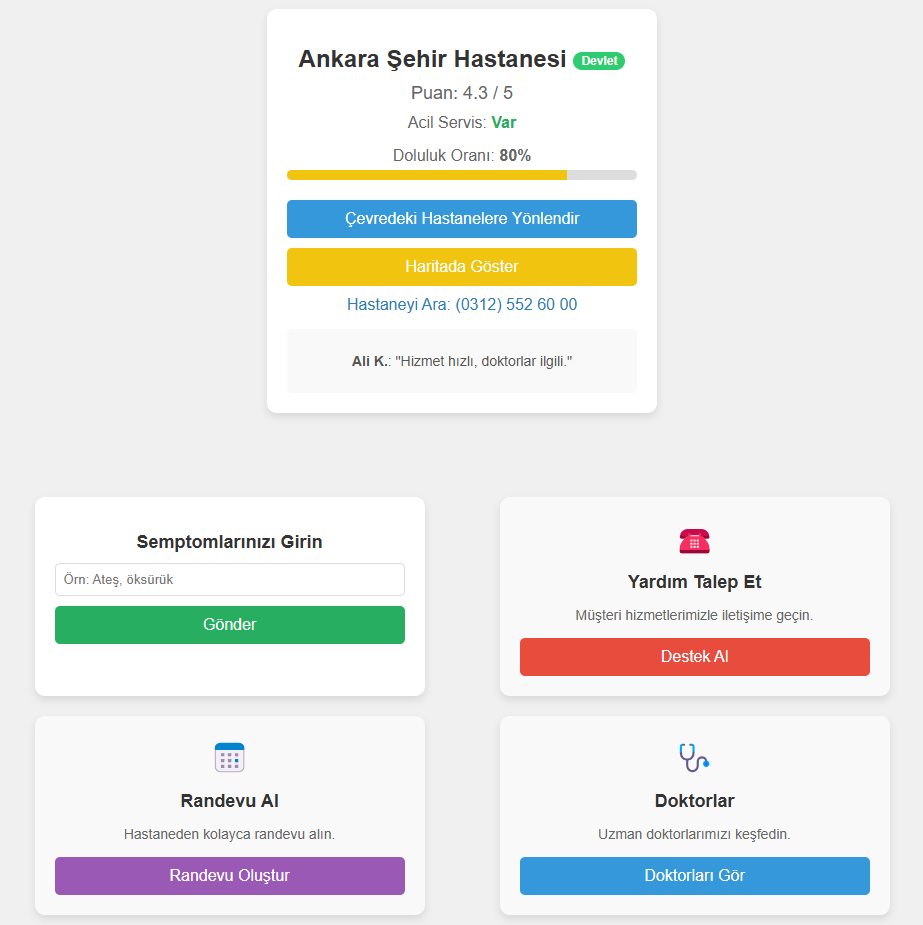

# FastCare - Hastane Yönetimi Demo Uygulaması

## Proje Açıklaması
Bu proje, **FastCare** adında bir hastane yönetimi ve sağlık hizmetleri demo web uygulamasıdır. Kullanıcılar, hastane bilgilerine erişebilir, semptom girebilir, randevu alabilir, doktorlar hakkında bilgi edinebilir ve müşteri desteği talep edebilir. Proje, HTML, CSS ve JavaScript kullanılarak geliştirilmiştir ve mobil uyumlulukla tasarlanmıştır.

### Ekran Görüntüleri
| Ana Sayfa Ekran Görüntüsü          | Hastane Sayfası Ekran Görüntüsü       |
|------------------------------------|---------------------------------------|
|          |         |

### Özellikler
- **Ana Sayfa:** Kullanıcıyı "Hoş Geldin [İsim]" mesajıyla karşılayan bir giriş ekranı.
- **Hastane Sayfası:** Ankara Şehir Hastanesi bilgilerini (puan, doluluk oranı, iletişim bilgileri) gösteren bir kart sistemi.
- **Semptom Girişi:** Kullanıcıların semptomlarını girebileceği ve ilgili semptomların listelendiği bir alan.
- **Yardım Talebi:** Müşteri hizmetleriyle iletişime geçme seçeneği.
- **Randevu Al:** Hastaneden randevu alma özelliği.
- **Doktorlar:** Uzman doktorları görüntüleme seçeneği.
- **Mobil Uyumluluk:** Farklı ekran boyutlarına uyumlu tasarım.

### Dosya Yapısı
fastcare-demo/
│
├── index.html             
├── hospital.html        
├── styles.css           
├── welcome.js             
├── hospital.js            
├── logo.png              
└── README.md    

### Teknolojiler
HTML5: Yapısal tasarım.
CSS3: Stil ve mobil uyumluluk.
JavaScript: Dinamik işlevsellik (semptom ekleme, yönlendirme).

### Ek Notlar
Bu sürüm, henüz bir demo versiyondur. 
